<ol>
<li>

We are going to begin by getting a copy of the project "genghiscon_world" from the profh directory on github. Get a copy of that file by typing the following on the command line:

<pre><code>  git clone https://github.com/profh/genghiscon_world.git
</code></pre>
</li>
<li>

Once you have a copy of the project on your machine, do the following:

<ul>
<li>
change the name of the project directory to <code>&lt;your_github_id&gt;_world</code> (without the <code>&lt;...&gt;</code>, and where your_github_id is your actual github id) and then switch into that directory. (If you don't have an account, go get one right now...)
</li>
<li>
look at the git log with the command <code>git log --oneline --graph</code> (NOTE: if you have Prof. H's dotfiles installed, just type 'gl' and you will get all this and some extra) and you see the git history for this project.
</li>
<li>
Type the command <code>git remote -v</code> to see information about any remote repositories.  A "remote" is just another git repository and you've been working with a remote on darkknight all semester long. In this case, it's github, but it could also be a peer's computer, shared server (like darkknight), or even another directory on the same machine.  For more information on remotes, and git knowledge in general, visit: <a href="http://gitref.org">http://gitref.org</a>.
</li>
<li>
Remove the remote named origin (it should be the only one). Confirm its deletion by re-running the command <code>git remote -v</code> and verifying there is no origin.
</li>
<li>
If in doubt, your terminal window should look something like this:
</li>
</ul>

<a href="lab14-1.png" target="_blank">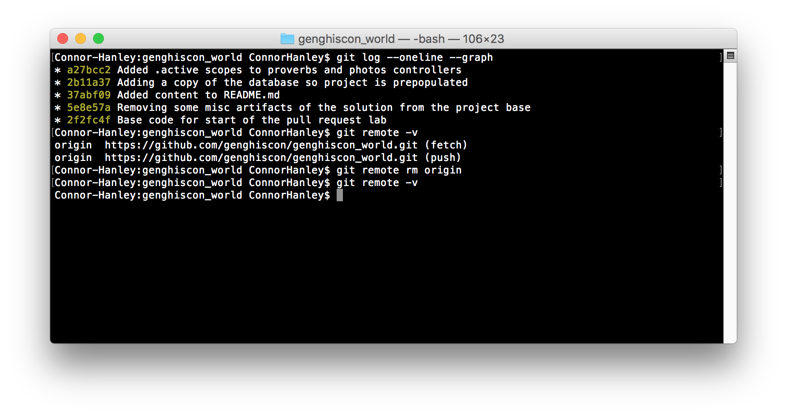</a>

</li>
</ol>

<ol>
<li>
To make the project operational, first run the bundle command to install any missing gems. To speed things along, the project already has a prepopulated development.sqlite3 database to give you some idea of what this project is about. (If for some reason there is a problem with the db, the sql code to recreate it is in the doc/ directory.) Once you feel comfortable with the application, customize it as you wish, although you don't have to do anything if you don't wish to.
</li>
<li>

Now we are going to create a repository for the revised project on github. Log into github (if you haven't already) and create an empty repository called <code>&lt;your_github_id&gt;_world</code>. The screenshot below will show you how it would look before you press the green 'Create repository' button:</your_github_id>

<a href="lab14-2.png" target="_blank">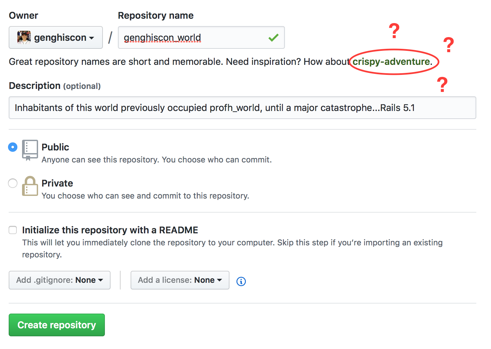</a>

</li>
<li>

After the repo is created, github gives you the following instructions (wait just a moment before executing these):

<pre><code>  git remote add origin https://github.com/&lt;your_github_id&gt;/&lt;your_github_id&gt;_world.git 
  git push -u origin master
</code></pre>

Why are they telling us this? The point is that now that we have created the remote repository on github, we need to add that remote to our local repo so the two are connected. The general "formula" for adding a remote repository is:

<pre><code>  git remote add &lt;REMOTE&gt; &lt;URL&gt;:&lt;REPO&gt;
</code></pre>

The REMOTE can be named whatever you want, but convention usually dictates that you name it origin. For github, the URL is <a href="mailto:git@github.com">https://github.com</a>, and your REPO is namespaced under your github_id.

But wait just a moment: Before we finally push, we should add a few things to our .gitignore file for better consistency throughout our revision history. Let’s start with the <code>coverage</code> directory (created whenever we run tests using SimpleCov) by adding the following code to our .gitignore file:

<pre><code>  # Ignore all test coverage files
  /coverage/*
</code></pre>

This will ensure that changes to our coverage files (which will fluctuate constantly based on our local tests) will never get recorded in our commmits. If we didn't do this, this could cause merge conflicts later on, especially in a project involving multiple contributors who are all testing and changing the same files.

And while we’re at it, if you are a macOS user, run the following two lines in the command line to ignore .DS_Store files across all directories and subdirectories of your git repositories. This will ensure you are never pushing changes regarding this file, which changes constantly and is contained within most folders on the macOS file system by default (for local purposes). Note that there are various situations where you might want to use .gitignore to allow for a cleaner and more consistent revision history, but we will not go over them all here.

<pre><code>  echo .DS_Store >> ~/.gitignore_global
  git config --global core.excludesfile ~/.gitignore_global
</code></pre>

Now that you have set up your remote and ignored the proper files, add the remote repository to your repo.  Push your code to github (git push -u origin master), and verify that it now shows up on github.com. 
Your screen should like something like this:

<a href="lab14-3.png" target="_blank">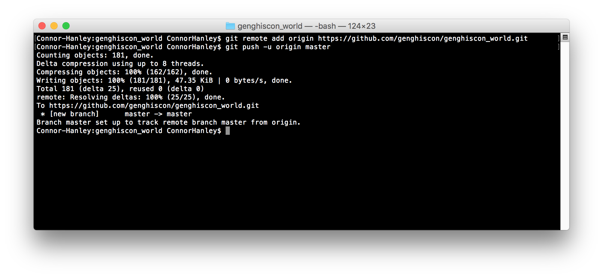</a>

Once this is done and your project is on github, notify a TA and tell him/her your github id so that you can be paired with another person.

</li>
<li>
Find another student/team to work with -- write your partner's name(s) on the front of this lab now. If you can't find a partner - ask a TA and they will help you make friends. You will be doing two roles at roughly the same time. In the first role, you will be the 'maintainer' of your project on github. In the later part of the lab, there are instructions for you to follow as the maintainer. It will require you to check in periodically to see if there have been any pull requests posted that you will need to review and possibly accept. In the second role you will be the 'requester' who will be adding additional functionality to the project and requesting that the maintainer pull your changes into the original project. I will put the name of the role in the beginning of the line so you know what role you are acting in.
</li>
<li>

(<strong>Requester</strong>) Go to the github repo of the person you are assigned to. Start by forking the project you've been paired with by clicking the 'Fork' button towards the upper right corner as seen below:

<a href="lab14-4.png" target="_blank">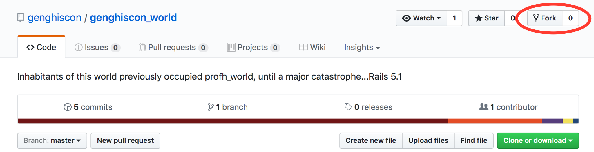</a>

Now clone this forked project from your github account so you have a copy on your local machine. Create a branch in the forked project called "articles" and switch to that branch now. In this branch, create a new model called Article using the command <code>rails generate model Article ...</code> with the following fields:

<ul>
<li>title:string</li>
<li>content:text</li>
<li>category_id:integer</li>
<li>active:boolean</li>
</ul>

Now run the migration to add this table to the database. Once complete, go into the model and set the relationship to category (and also go into the Category model and set the relationship with Article). With relationships set, make sure that title and content are required fields and set up two scopes: alphabetical (which orders the records alphabetically by title) and active (which only returns active articles). Have a TA look over your model code before proceeding so you know the model is correct. Once you get the thumbs-up, commit this code to the <code>articles</code> branch. Rerun git log to verify it was committed.

</li>
<li>

(<strong>Requester</strong>) Now that you are sure you have a decent working version for articles, it is time to open up a pull request. A pull request is a formal way of asking the maintainer to merge your code into his/her project.

<ul>
<li>
Push your changes back to your forked repository on github with the command git push origin articles
</li>
<li>
On the forked project's github page (i.e., in your github account), switch to the branch 'articles' (yellow box)
</li>
<li>
Press the 'Compare & pull request' button within the yellow box. You will get a form asking for a title and description of the pull request as seen below – fill this out with information that will be useful to the maintainer and help him/her decide how to handle the request. (Just like git log loses value quickly with meaningless comments like "made changes", a pull request with meaningful comments help a lot and make it more likely to be accepted by the maintainer.) 
</li>
</ul>

Be sure that you see something similar to the screenshot below indicating that you are asking the maintainer to pull in your code (obviously the names and the like will be different): 

<a href="lab14-5.png" target="_blank">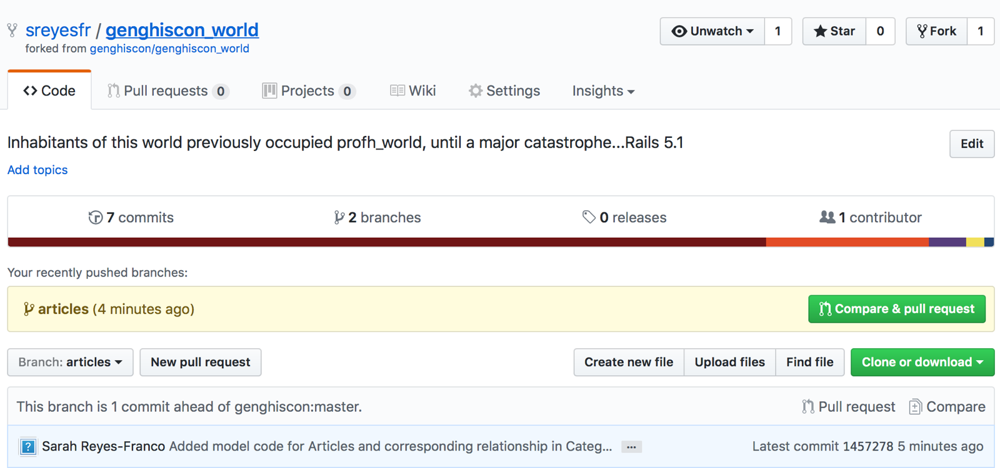</a>  

If everything looks good, submit the request by clicking the green 'Create pull request' button on the bottom right of the page.

<a href="lab14-6.png" target="_blank">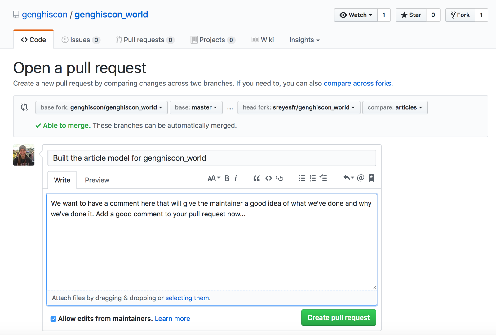</a>  

</li>
</ol>

<ol>
<li>

(<strong>Maintainer</strong>) Go to your project page and see if you have any pull requests yet. (People work at different speeds so just because you are done doesn't mean your partner is; you may have to check back periodically.) If you look at the project bar near the top, you see that the third item from the left is for pull requests; if the number next to it is one, then you have a pending request. If so, click on the tab and review your list of pull requests. You will see something similar to what is below:

<a href="lab14-7.png" target="_blank">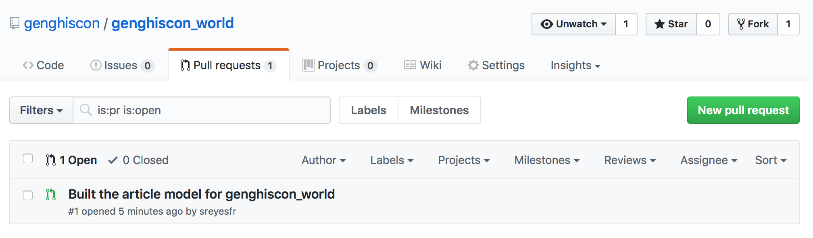</a>

Click on the pull request itself to get more information on the request as seen below:

<a href="lab14-8.png" target="_blank">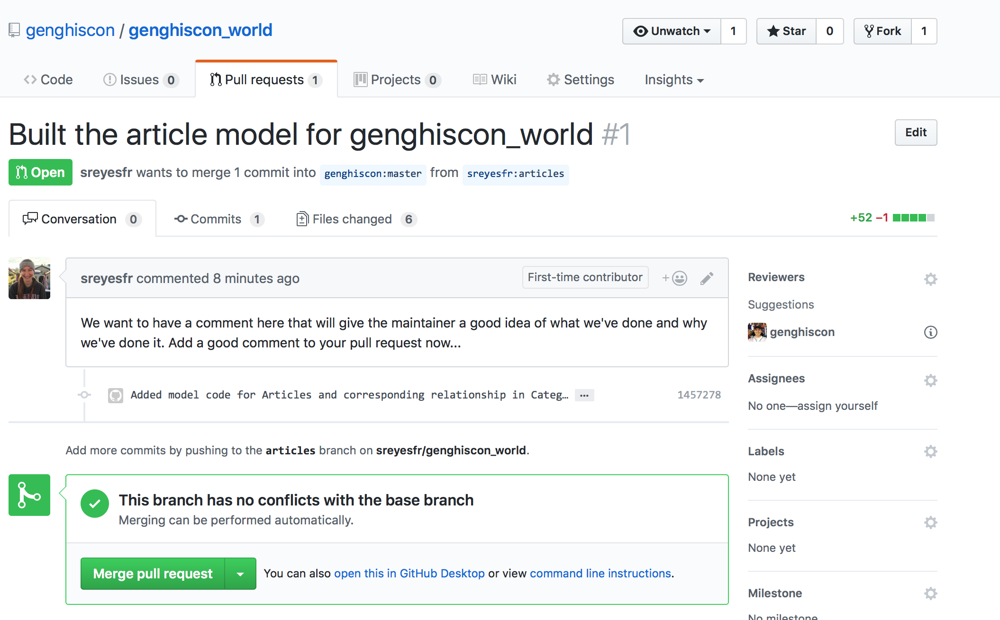</a> 

<strong>WARNING</strong>: Do <strong>NOT</strong> click on 'Merge pull request' until explicitly instructed towards the end of the lab! You can review the code changes by clicking on the commits tab and selecting a commit to look at, as seen in the screenshots below (and if while browsing the commit you click on the 'Browse code' button in the blue bar, you will go to the forked repo; you can even clone it and run it locally to see if you like it).

<a href="lab14-8a.png" target="_blank">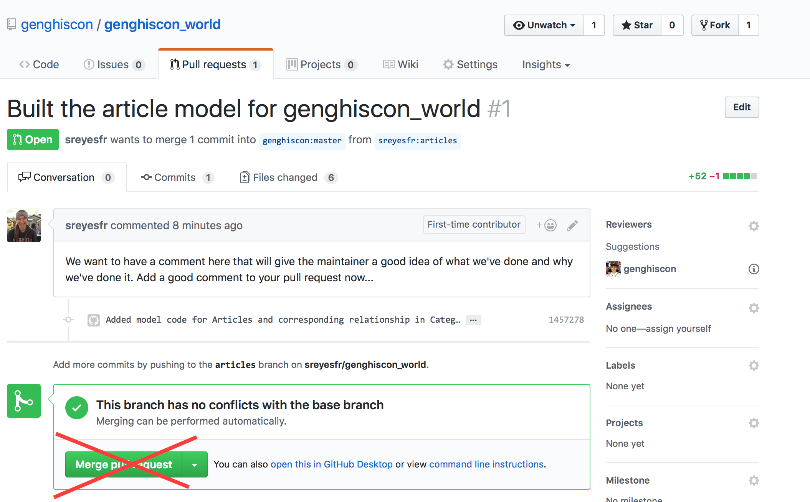</a> 

Clicking on the 'Added model code . . .' link, we see ...

<a href="lab14-9.png" target="_blank">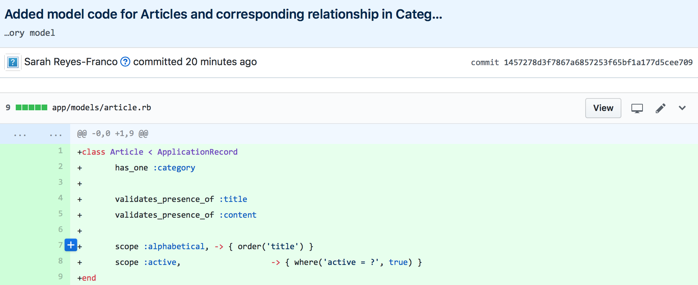</a> 

However, as nice as this is, you should NOT merge this change into your project yet. Back on the pull request details page, scroll down to find a box for 'Leave a comment', and leave the following comment:

"I really like the idea of adding articles, but I think it needs more than just the models before I can make a decision. After all, Rails is all about MVC working together, not just the M portion in isolation. If the views and controller are in working order, then I'll pull this into my project."

<a href="lab14-9a.png" target="_blank">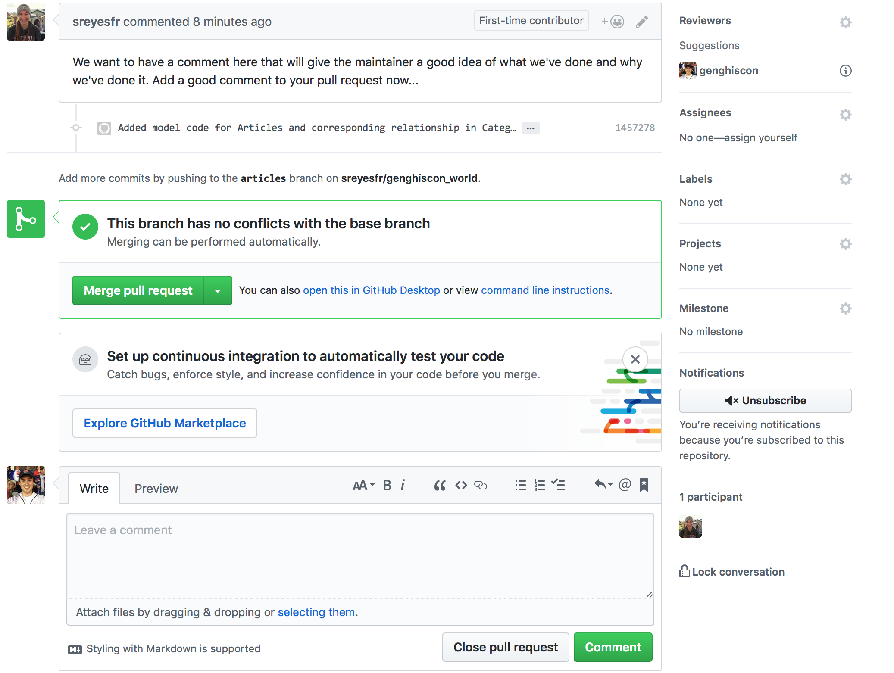</a> 

Submit this comment and see that it was added to the pull request. Then go back to your work as a requestor.

</li>
<li>
(<strong>Requester</strong>) Check on your pull request and see if there has been any response yet. Once you see the response, clench your fists and say (quietly) "Oh shoot, I totally forgot about the views and controller!" You know you need to make controllers and views, but now start to wonder if there is a shortcut. Then you remember seeing something unusual in the git log when you ran it earlier. Re-run the command <code>git log --oneline --graph</code> (or just <code>gl</code>) and notice the second commit with the comment "Removing some misc artifacts of the solution from the project base". You think to yourself that there might be a shortcut there if only I could access the project contents before that second commit; after all if Prof. H deleted files that were part of the solution, then perhaps the controller and views are still there in the repo. 'How could I see that?' you start to wonder...
</li>
<li>

(<strong>Requester</strong>) There is a way with git to get those files back. Remember in class we could checkout an individual file from the repo if we didn't like the changes made to it. We can also checkout entire commits and put them on a branch to investigate and possibly recover. To do this here we will take the following steps (see screenshot on next page if uncertain):

<ul>
<li>Move a copy of that first commit to a branch called 'recovery' with the following command, substituting the seven (or more) character sha value of the first commit for the item in angle brackets:</li>
</ul>

<pre><code>  git checkout &lt;sha value of the first commit&gt; -b recovery
</code></pre>

<ul>
<li>
Look at the README file in your working directory – it should be empty now (remember from git log comments that content wasn't added until the third commit). Then look in the <code>doc/</code> directory; you notice two things of interest. First, you see a directory called <code>article views/</code> and second, there's a file called <code>article_controller.sample.rb</code> – <em>jackpot.</em>
</li>
<li>
Now the trick is to transfer these items to their right places. Start with the controller by using the unix cp (copy) command to transfer the file from its current location to a new destination:
</li>
</ul>

<pre><code>  cp doc/articles_controller.sample.rb app/controllers/articles_controller.rb
</code></pre>

<ul>
<li>Next,create a directory for the views with the <code>mkdir</code> command: <code>mkdir app/views/articles</code>. Now transfer the views into their proper directory with the command (we add the -r flag to cp this time in order to do this recursively and grab all the files in the origin directory).</li>
</ul>

<pre><code>  cp -r doc/articles_views/ app/views/articles/
</code></pre>

<ul>
<li>Verify that this has been done correctly and then commit these changes to the recovery branch on git. Below is a screenshot of what we just did on the command line if you are unsure:</li>
</ul>

 

</li>
</ol>

<ol>
<li>

(<strong>Requester</strong>) Now we need to merge these changes back into the articles branch, which is the branch we are using for our pull request. Do so now (remember you have to go back to 'articles' branch first to make the merge) and then fire up rails server and try out the new articles functionality. Going to <a href="http://localhost:3000/articles">http://localhost:3000/articles</a> immediately runs into trouble. What is the error message telling you? This is an easy fix, but if you are stuck, you can look below for help. Make the revision, verify it works, and then commit the change to the articles branch (which you should be on). Then push your changes to GitHub. 

(hint on error: We remember that controllers and routes often go hand-in-hand. A controller action without a route will rarely get invoked while a route with a missing controller action will raise an exception. The easy fix is to add <code>resources :articles</code> to our config/routes.rb file to automatically generate our seven RESTful routes we need in this case.)

</li>
<li>
(<strong>Maintainer</strong>) Go back to see if changes have been made to the pull request. Seeing that there are, review the changes and verify that they work as advertised. (If not, send a message explaining the errors encountered.) Once you have verified the article functionality has complete CRUD functionality, you can now merge these changes into your master branch by pushing the green Merge pull request button (that we crossed out in an earlier screenshot).
</li>
<li>
Have the TA check off that you have a project in your github account with article functionality and a record of the dialog back and forth between you and the requester AND that you have been a requester of another student who also has a revised repository – if so, you're done!
</li>
</ol>
